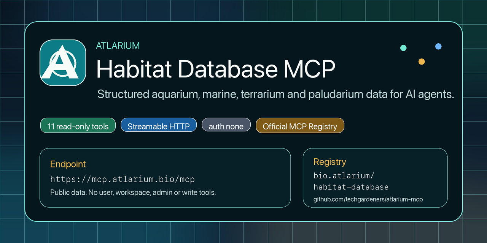

<p align="center">
  
</p>

<h1 align="center">Atlarium Habitat Database MCP</h1>

<p align="center">
  Structured aquarium, marine, terrarium and paludarium data for AI agents.
</p>

<p align="center">
  <a href="https://github.com/techgardeners/atlarium-mcp/actions/workflows/public-mcp-monitor.yml"></a>
  <a href="https://github.com/techgardeners/atlarium-mcp/actions/workflows/mcp-directory-audit.yml"></a>
  <a href="LICENSE"></a>
  <a href="https://registry.modelcontextprotocol.io/v0.1/servers?search=bio.atlarium%2Fhabitat-database"></a>
  
  
  
</p>

Atlarium Habitat Database MCP is a public read-only MCP server that gives AI
agents structured access to Atlarium habitat data. It exposes public tools for
species, plants, products, water parameters, compatibility checks, guides and
habitat planning without exposing Atlarium accounts, private workspaces, admin
APIs or write operations.

## At A Glance

| Surface | Value |
| --- | --- |
| MCP endpoint | `https://mcp.atlarium.bio/mcp` |
| Transport | Streamable HTTP |
| Authentication | none |
| Tool surface | 11 public read-only tools |
| Server card | `https://mcp.atlarium.bio/.well-known/mcp/server-card.json` |
| Human docs | `https://atlarium.bio/mcp` |
| Official MCP Registry | `bio.atlarium/habitat-database` |

`https://atlarium.bio/mcp` is documentation. The canonical Streamable HTTP MCP
endpoint is `https://mcp.atlarium.bio/mcp`.

## Quickstart

Use any MCP client that supports remote Streamable HTTP servers.

```json
{
  "mcpServers": {
    "atlarium": {
      "type": "streamable-http",
      "url": "https://mcp.atlarium.bio/mcp"
    }
  }
}
```

Claude Code remote HTTP example:

```bash
claude mcp add --transport http atlarium https://mcp.atlarium.bio/mcp
```

Smoke check the live endpoint:

```bash
curl --fail --silent --show-error https://mcp.atlarium.bio/health
curl --fail --silent --show-error https://mcp.atlarium.bio/.well-known/mcp/server-card.json
pnpm mcp:monitor:public
```

## Tool Surface

| Area | Tools |
| --- | --- |
| Fish and aquatic animals | `search_fish`, `get_fish_profile` |
| Aquatic plants | `search_plants`, `get_plant_profile` |
| Habitat products | `search_products`, `get_product_profile` |
| Planning and compatibility | `check_species_compatibility`, `get_water_parameters`, `suggest_species_for_tank` |
| Guides | `search_guides`, `get_guide` |

All tools are read-only. Compatibility checks and tank suggestions are advisory
and should be verified against real livestock, equipment, water chemistry and
husbandry constraints.

## Client Examples

Client-specific examples live in `examples/`:

- `examples/openai-agents-python`
- `examples/claude-code`
- `examples/cursor`
- `examples/windsurf`
- `examples/vscode`
- `examples/antigravity`
- `examples/chatgpt-apps`
- `examples/generic-streamable-http`

Do not describe this server as officially supported by ChatGPT, Claude, Cursor,
Windsurf, VS Code, Antigravity or any directory unless that vendor has accepted
the listing.

## Discovery And Directory Status

| Directory | Status |
| --- | --- |
| Official MCP Registry | Published as `bio.atlarium/habitat-database`. |
| Glama | Indexed as a connector; ownership claim is prepared through `/.well-known/glama.json`. |
| Smithery | Ready for maintainer submission; no public listing claim yet. |
| MCP.so | Submitted through the public GitHub issue flow; no public listing badge yet. |
| PulseMCP | Listed publicly; automated checks may still be blocked by Cloudflare. |

Publication tracking and reusable submission copy live in
`docs/publication-checklist.md` and `docs/directory-submission-payloads.md`.

## Apps-Compatible Widget

The server advertises a read-only MCP Apps / ChatGPT Apps widget resource for
Apps-compatible hosts:

- resource URI: `ui://widget/habitat-explorer.v2.html`
- MIME type: `text/html;profile=mcp-app`
- widget: `Atlarium Habitat Explorer`

This is not a public ChatGPT approval claim. Tool responses keep plain JSON text
for generic MCP clients and also return `structuredContent` for compatible
widget hosts.

## Public Validation

Run the live monitor and full public tool validation:

```bash
pnpm mcp:monitor:public
pnpm mcp:validate:public
pnpm directories:submit -- --check
```

## Local Development

```bash
pnpm install
cp .env.example .env
pnpm dev
```

By default the server listens on `http://localhost:43118`.

Local development against the Atlarium app:

```bash
ATLARIUM_API_BASE_URL=http://localhost:43117/api/public/mcp/v1 pnpm dev
```

## Configuration

- `MCP_PUBLIC_BASE_URL`: public base URL, production default `https://mcp.atlarium.bio`.
- `ATLARIUM_API_BASE_URL`: public read-only Atlarium API base URL.
- `MCP_ALLOWED_HOSTS`: comma-separated host allowlist used for DNS rebinding protection.
- `MCP_TRUST_PROXY`: Express proxy trust setting; default `1` assumes one trusted reverse proxy in production.
- `ATLARIUM_API_TIMEOUT_MS`: upstream public API timeout in milliseconds.
- `ATLARIUM_API_RESPONSE_MAX_BYTES`: maximum upstream JSON response size.

Production deployments must run behind a TLS-terminating reverse proxy or
Ingress that overwrites `X-Forwarded-For`, `X-Forwarded-Host` and
`X-Forwarded-Proto` before traffic reaches this server.

## Publication And Directories

Publication tracking and reusable submission copy live in
`docs/publication-checklist.md`.

Directory-specific payloads and technical launch copy live in
`docs/directory-submission-payloads.md` and
`docs/mcp-technical-launch-kit.md`.

GitHub repository presentation notes and social preview upload steps live in
`docs/github-showcase.md`.

Generate directory payloads:

```bash
pnpm directories:submit -- --payload
```

Check live discovery:

```bash
pnpm directories:submit -- --check
```

## Kubernetes

Kubernetes manifests live in `deploy/kubernetes`.

Preferred Atlarium local pipeline:

```bash
pnpm pipeline:local
PUSH_IMAGE=true pnpm pipeline:local
PUSH_IMAGE=true DEPLOY_KUBERNETES=true pnpm pipeline:local
PUSH_IMAGE=true DEPLOY_KUBERNETES=true VALIDATE_PUBLIC=true pnpm pipeline:local
```

The image is published as `ghcr.io/techgardeners/atlarium-mcp`.

## Quality Gate

```bash
pnpm lint
pnpm typecheck
pnpm test
pnpm build
pnpm audit:prod
docker build -t atlarium-mcp:local .
```

With a local server running:

```bash
pnpm mcp:conformance
```

With production DNS and TLS live:

```bash
pnpm mcp:conformance:public
pnpm mcp:validate:public
```

## Contributing

See `CONTRIBUTING.md`. Public tool changes must update the server
implementation, tests, server-card metadata, `server.json`, docs, examples and
directory publication notes in the same release.

## Security

See `SECURITY.md`. Do not report sensitive security issues in public GitHub
issues.

## License

MIT. See `LICENSE`.
